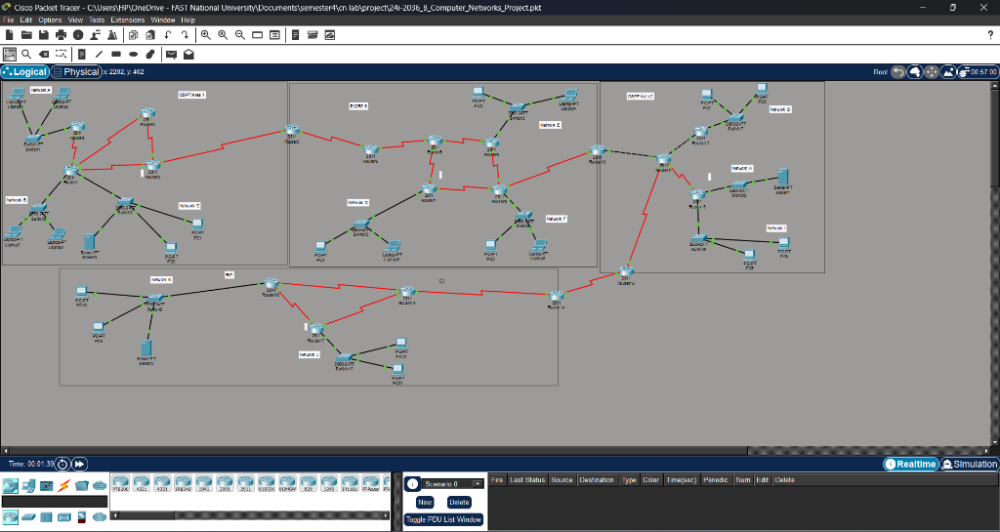

# Multi-Area Network Design and Implementation

**Cisco Packet Tracer Enterprise Network Project**

---

**Student:** Alishba Inam | **Roll No:** 24I-2036 | **Semester:** 4th - BS Cyber Security

**University:** FAST National University | **Course:** Computer Networks Lab

---

## Table of Contents

- [Project Overview](#project-overview)
- [Network Architecture](#network-architecture)
- [VLSM Subnetting Scheme](#vlsm-subnetting-scheme)
- [Routing Domains and Protocols](#routing-domains-and-protocols)
- [Route Redistribution](#route-redistribution)
- [Network Services](#network-services)
- [Security Implementation](#security-implementation)
- [Device Inventory](#device-inventory)
- [WAN Link Design](#wan-link-design)
- [Testing and Verification](#testing-and-verification)
- [Repository Contents](#repository-contents)
- [How to Open](#how-to-open)

---

## Project Overview

This project implements a large-scale enterprise network consisting of **four distinct routing domains** interconnected through route redistribution. The design serves **11 subnets (Networks A-K)** across multiple departments, using **VLSM** (Variable Length Subnet Masking) for efficient IP allocation from a single Class A address space.

### Key Objectives

| # | Objective | Status |
|---|-----------|--------|
| 1 | Design a multi-area network using VLSM from base 72.0.0.0/8 | Done |
| 2 | Implement OSPF Area 1, EIGRP AS 5, OSPF Area 2, and RIPv2 | Done |
| 3 | Configure mutual route redistribution at all domain borders | Done |
| 4 | Deploy centralized DHCP with relay agents across all networks | Done |
| 5 | Set up DNS, HTTP, and SMTP/POP3 email services | Done |
| 6 | Apply Static NAT for address translation | Done |
| 7 | Implement Extended ACLs for traffic filtering | Done |

### Assigned Data

| Item | Value |
|------|-------|
| **Base Network** | 72.0.0.0/8 |
| **Public IP (NAT)** | 72.195.221.244 |
| **Private IP (NAT)** | 1.139.135.189 |

---

## Network Architecture

The network is organized into **four routing domains** connected through **three redistribution border routers**, with **19 routers**, **11 switches**, **3 servers**, and **20+ end devices**.



### Redistribution Points

| Border Router | Connects | Direction |
|--------------|----------|-----------|
| **Router2** | OSPF Area 1 to EIGRP 5 | Mutual redistribution |
| **Router10** | EIGRP 5 to OSPF Area 2 | Mutual redistribution |
| **Router18** | OSPF Area 2 to RIP | Mutual redistribution |

---

## VLSM Subnetting Scheme

### Host Requirements (Sorted Largest to Smallest)

| # | Network | Required Hosts | Host Bits | Block Size | Usable Hosts | CIDR |
|---|---------|---------------|-----------|------------|--------------|------|
| 1 | C | 107,957 | 17 | 131,072 | 131,070 | /15 |
| 2 | A | 101,175 | 17 | 131,072 | 131,070 | /15 |
| 3 | F | 98,305 | 17 | 131,072 | 131,070 | /15 |
| 4 | E | 87,687 | 17 | 131,072 | 131,070 | /15 |
| 5 | H | 81,173 | 17 | 131,072 | 131,070 | /15 |
| 6 | J | 66,518 | 17 | 131,072 | 131,070 | /15 |
| 7 | B | 64,770 | 16 | 65,536 | 65,534 | /16 |
| 8 | I | 57,250 | 16 | 65,536 | 65,534 | /16 |
| 9 | D | 49,116 | 16 | 65,536 | 65,534 | /16 |
| 10 | G | 46,641 | 16 | 65,536 | 65,534 | /16 |
| 11 | K | 36,065 | 16 | 65,536 | 65,534 | /16 |

### IP Allocation Table

| # | Net | CIDR | Subnet Mask | Network Addr | First Usable | Last Usable | Broadcast |
|---|-----|------|-------------|-------------|-------------|-------------|-----------|
| 1 | **C** | /15 | 255.254.0.0 | 72.0.0.0 | 72.0.0.1 | 72.1.255.254 | 72.1.255.255 |
| 2 | **A** | /15 | 255.254.0.0 | 72.2.0.0 | 72.2.0.1 | 72.3.255.254 | 72.3.255.255 |
| 3 | **F** | /15 | 255.254.0.0 | 72.4.0.0 | 72.4.0.1 | 72.5.255.254 | 72.5.255.255 |
| 4 | **E** | /15 | 255.254.0.0 | 72.6.0.0 | 72.6.0.1 | 72.7.255.254 | 72.7.255.255 |
| 5 | **H** | /15 | 255.254.0.0 | 72.8.0.0 | 72.8.0.1 | 72.9.255.254 | 72.9.255.255 |
| 6 | **J** | /15 | 255.254.0.0 | 72.10.0.0 | 72.10.0.1 | 72.11.255.254 | 72.11.255.255 |
| 7 | **B** | /16 | 255.255.0.0 | 72.12.0.0 | 72.12.0.1 | 72.12.255.254 | 72.12.255.255 |
| 8 | **I** | /16 | 255.255.0.0 | 72.13.0.0 | 72.13.0.1 | 72.13.255.254 | 72.13.255.255 |
| 9 | **D** | /16 | 255.255.0.0 | 72.14.0.0 | 72.14.0.1 | 72.14.255.254 | 72.14.255.255 |
| 10 | **G** | /16 | 255.255.0.0 | 72.15.0.0 | 72.15.0.1 | 72.15.255.254 | 72.15.255.255 |
| 11 | **K** | /16 | 255.255.0.0 | 72.16.0.0 | 72.16.0.1 | 72.16.255.254 | 72.16.255.255 |

### Network-to-Gateway Mapping

| Network | Subnet | Gateway Router | Interface | Gateway IP | Domain |
|---------|--------|---------------|-----------|------------|--------|
| A | 72.2.0.0/15 | Router4 | Fa0/1 | 72.2.0.1 | OSPF Area 1 |
| B | 72.12.0.0/16 | Router1 | Fa0/0 | 72.12.0.1 | OSPF Area 1 |
| C | 72.0.0.0/15 | Router1 | Fa0/1 | 72.0.0.1 | OSPF Area 1 |
| D | 72.14.0.0/16 | Router7 | Fa0/0 | 72.14.0.1 | EIGRP 5 |
| E | 72.6.0.0/15 | Router9 | Fa0/0 | 72.6.0.1 | EIGRP 5 |
| F | 72.4.0.0/15 | Router8 | Fa0/0 | 72.4.0.1 | EIGRP 5 |
| G | 72.15.0.0/16 | Router12 | Fa0/0 | 72.15.0.1 | OSPF Area 2 |
| H | 72.8.0.0/15 | Router13 | Fa0/0 | 72.8.0.1 | OSPF Area 2 |
| I | 72.13.0.0/16 | Router13 | Fa0/1 | 72.13.0.1 | OSPF Area 2 |
| J | 72.10.0.0/15 | Router17 | Fa0/0 | 72.10.0.1 | RIP |
| K | 72.16.0.0/16 | Router16 | Fa0/0 | 72.16.0.1 | RIP |

---

## Routing Domains and Protocols

### OSPF Area 1 (Process 1, Area 1)

- **Routers:** Router4, Router1, Router0, Router2
- **Networks:** A (72.2.0.0/15), B (72.12.0.0/16), C (72.0.0.0/15)
- **Role:** Campus core with DNS/Mail/Web servers
- **Key Features:** Router1 serves as hub with 3 serial ports; Router2 is the OSPF-EIGRP border

### EIGRP AS 5

- **Routers:** Router2, Router3, Router5, Router6, Router7, Router9, Router8, Router10
- **Networks:** D (72.14.0.0/16), E (72.6.0.0/15), F (72.4.0.0/15)
- **Role:** Distribution layer connecting the two OSPF areas
- **Key Features:** Router6 is transit-only (no LAN); dual border routers (R2, R10)

### OSPF Area 2 (Process 1, Area 2)

- **Routers:** Router10, Router11, Router12, Router13, Router18
- **Networks:** G (72.15.0.0/16), H (72.8.0.0/15), I (72.13.0.0/16)
- **Role:** Secondary campus with centralized DHCP server
- **Key Features:** Uses crossover Ethernet between R10-R11 and R11-R12

### RIPv2

- **Routers:** Router18, Router14, Router15, Router16, Router17
- **Networks:** J (72.10.0.0/15), K (72.16.0.0/16)
- **Role:** Remote sites with NAT gateway
- **Key Features:** Multiple redundant paths (R15-R17, R17-R14 loops)

---

## Route Redistribution

Mutual redistribution is configured at three border routers to enable full end-to-end connectivity:

| Border Router | From to To | Command | Context |
|--------------|-----------|---------|---------|
| Router2 | EIGRP 5 to OSPF 1 | `redistribute eigrp 5 subnets` | `router ospf 1` |
| Router2 | OSPF 1 to EIGRP 5 | `redistribute ospf 1 metric 1500 100 255 1 1500` | `router eigrp 5` |
| Router10 | EIGRP 5 to OSPF 1 | `redistribute eigrp 5 subnets` | `router ospf 1` |
| Router10 | OSPF 1 to EIGRP 5 | `redistribute ospf 1 metric 1500 100 255 1 1500` | `router eigrp 5` |
| Router18 | RIP to OSPF 1 | `redistribute rip subnets` | `router ospf 1` |
| Router18 | OSPF 1 to RIP | `redistribute ospf 1 metric 5` | `router rip` |

**EIGRP Metric Format:** Bandwidth, Delay, Reliability, Load, MTU = 1500 100 255 1 1500

---

## Network Services

### DNS, Web and Mail Server - Server0 (72.0.0.2, Network C)

| Service | Config |
|---------|--------|
| **DNS** | www.project.com - A Record - 72.0.0.2 |
| **HTTP** | Default web page served on port 80 |
| **SMTP/POP3** | Domain: project.com, 6 user accounts registered |

**Email Users:** laptop0 through laptop3, pc0, pc1 - all @project.com

### Centralized DHCP - Server1 (72.8.0.2, Network H)

Server1 provides DHCP for **10 networks** (all except H where it resides). DHCP relay (ip helper-address 72.8.0.2) is configured on every gateway router.

| Pool | Gateway | Start IP | Subnet Mask |
|------|---------|----------|-------------|
| Net-A | 72.2.0.1 | 72.2.0.10 | 255.254.0.0 |
| Net-B | 72.12.0.1 | 72.12.0.10 | 255.255.0.0 |
| Net-C | 72.0.0.1 | 72.0.0.10 | 255.254.0.0 |
| Net-D | 72.14.0.1 | 72.14.0.10 | 255.255.0.0 |
| Net-E | 72.6.0.1 | 72.6.0.10 | 255.254.0.0 |
| Net-F | 72.4.0.1 | 72.4.0.10 | 255.254.0.0 |
| Net-G | 72.15.0.1 | 72.15.0.10 | 255.255.0.0 |
| Net-I | 72.13.0.1 | 72.13.0.10 | 255.255.0.0 |
| Net-J | 72.10.0.1 | 72.10.0.10 | 255.254.0.0 |
| Net-K | 72.16.0.1 | 72.16.0.10 | 255.255.0.0 |

---

## Security Implementation

### NAT (Network Address Translation) - Router17

| Setting | Value |
|---------|-------|
| Type | Static NAT |
| Inside Local | 1.139.135.189 |
| Inside Global | 72.195.221.244 |
| Inside Interface | Fa0/0 (Network J) |
| Outside Interfaces | Se0/0/0, Se0/0/1, Se0/1/0 |

### ACL 1 - Block Single Host (Router4)

Blocks Laptop2 (72.2.0.10) from reaching Server0 (72.0.0.2):

```
access-list 100 deny ip host 72.2.0.10 host 72.0.0.2
access-list 100 permit ip any any
! Applied inbound on Fa0/1
```

### ACL 2 - Block Entire Subnet (Router7)

Blocks all of Network D (72.14.0.0/16) from reaching Server0:

```
access-list 101 deny ip 72.14.0.0 0.0.255.255 host 72.0.0.2
access-list 101 permit ip any any
! Applied inbound on Fa0/0
```

---

## Device Inventory

### Routers (19x Cisco 2811)

| Router | Role | WIC-2T Modules | LAN Networks |
|--------|------|---------------|-------------|
| Router0 | OSPF transit | 1 | None |
| Router1 | OSPF hub, Net B+C gateway | 2 | B, C |
| Router2 | OSPF-EIGRP border | 2 | None |
| Router3 | EIGRP entry | 1 | None |
| Router4 | Net A gateway | 1 | A |
| Router5 | EIGRP transit | 1 | None |
| Router6 | EIGRP transit (no LAN) | 2 | None |
| Router7 | Net D gateway | 1 | D |
| Router8 | Net F gateway | 2 | F |
| Router9 | Net E gateway | 1 | E |
| Router10 | EIGRP-OSPF2 border | 1 | None |
| Router11 | OSPF2 hub | 1 | None |
| Router12 | Net G gateway | 0 | G |
| Router13 | Net H+I gateway | 1 | H, I |
| Router14 | RIP core | 2 | None |
| Router15 | RIP transit | 2 | None |
| Router16 | Net K gateway | 1 | K |
| Router17 | Net J gateway + NAT | 2 | J |
| Router18 | OSPF2-RIP border | 1 | None |

### Servers (3x)

| Server | Location | IP | Services |
|--------|----------|----|----------|
| Server0 | Network C | 72.0.0.2 | DNS, HTTP, SMTP/POP3 |
| Server1 | Network H | 72.8.0.2 | DHCP (centralized) |
| Server2 | Network K | 72.16.0.2 | None |

### Switches (11x) and End Devices (20+)

All end devices use **DHCP** for IP configuration except the three servers which use **static IPs**.

---

## WAN Link Design

22 point-to-point WAN links using /30 subnets starting at 72.17.0.0:

| WAN | Link | Subnet | Side-1 | Side-2 |
|-----|------|--------|--------|--------|
| W1 | R4 - R1 | 72.17.0.0/30 | .1 | .2 |
| W2 | R1 - R0 | 72.17.0.4/30 | .5 | .6 |
| W3 | R0 - R2 | 72.17.0.8/30 | .9 | .10 |
| W4 | R2 - R3 | 72.17.0.12/30 | .13 | .14 |
| W5 | R3 - R5 | 72.17.0.16/30 | .17 | .18 |
| W6 | R5 - R6 | 72.17.0.20/30 | .21 | .22 |
| W7 | R6 - R7 | 72.17.0.24/30 | .25 | .26 |
| W8 | R6 - R9 | 72.17.0.28/30 | .29 | .30 |
| W9 | R9 - R8 | 72.17.0.32/30 | .33 | .34 |
| W10 | R8 - R10 | 72.17.0.36/30 | .37 | .38 |
| W11 | R10 - R11 | 72.17.0.40/30 | .41 | .42 |
| W12 | R11 - R12 | 72.17.0.44/30 | .45 | .46 |
| W13 | R11 - R13 | 72.17.0.48/30 | .49 | .50 |
| W14 | R11 - R18 | 72.17.0.52/30 | .53 | .54 |
| W15 | R18 - R14 | 72.17.0.56/30 | .57 | .58 |
| W16 | R14 - R15 | 72.17.0.60/30 | .61 | .62 |
| W17 | R15 - R16 | 72.17.0.64/30 | .65 | .66 |
| W18 | R16 - R17 | 72.17.0.68/30 | .69 | .70 |
| W19 | R15 - R17 | 72.17.0.72/30 | .73 | .74 |
| W20 | R7 - R8 | 72.17.0.76/30 | .77 | .78 |
| W21 | R17 - R14 | 72.17.0.80/30 | .81 | .82 |
| W22 | R1 - R2 | 72.17.0.84/30 | .85 | .86 |

**Cable Types:** Serial DCE (WAN), Crossover Ethernet (R10-R11, R11-R12), Straight-through (Switch-Router, Switch-Host)

---

## Testing and Verification

### End-to-End Connectivity

| From | To | Expected | Reason |
|------|----|----------|--------|
| Laptop3 (Net A) | Server0 (72.0.0.2) | PASS | Normal connectivity |
| Laptop0 (Net B) | Net J gateway (72.10.0.1) | PASS | Cross-domain redistribution |
| PC7 (Net G) | Net A gateway (72.2.0.1) | PASS | OSPF2 to EIGRP to OSPF1 |
| PC12 (Net J) | Net G gateway (72.15.0.1) | PASS | RIP to OSPF2 |
| PC4 (Net D) | Server0 (72.0.0.2) | BLOCKED | ACL denies Network D |
| Laptop2 (72.2.0.10) | Server0 (72.0.0.2) | BLOCKED | ACL denies specific host |

### Service Verification

| Test | Method | Result |
|------|--------|--------|
| DNS Resolution | Browse www.project.com | Website loads |
| Web Access | Browse http://72.0.0.2 | Page served |
| Email Send | Laptop3 Compose to laptop0@project.com | Sent |
| Email Receive | Laptop0 Receive | Received |
| DHCP | Any PC IP Config DHCP | IP assigned |
| NAT | show ip nat translations on R17 | Translation active |

---

## Repository Contents

```
24i-2036_B_Computer_Networks_Project.pkt   -- Cisco Packet Tracer simulation file
i242036_project_report.docx                -- Formal project report with screenshots
README.md                                  -- This documentation
```

---

## How to Open

1. **Install** Cisco Packet Tracer (version 8.0+) from https://www.netacad.com/courses/packet-tracer
2. **Open** the .pkt file in Packet Tracer
3. **Wait** around 30 seconds for all routing protocols to converge
4. **Test** connectivity using the Command Prompt on any end device

---

**Prepared by Alishba Inam (24I-2036) - May 2026**

*FAST National University - BS Cyber Security - Semester 4*
